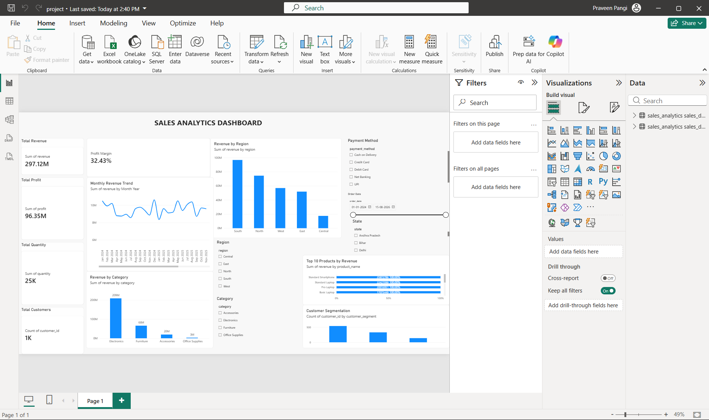

# Sales Analytics Dashboard

An end-to-end sales analytics project using MySQL, SQL, Python, Pandas, and Microsoft Power BI.

## Project Overview

This project analyzes sales data to identify revenue trends, profitability, product performance, regional performance, and customer insights.

The project combines database management, SQL analysis, Python data processing, and Power BI visualization to create an interactive sales analytics dashboard.

## Dataset

The project contains the following datasets:

- Customers
- Products
- Orders
- Order Details
- Sales Analysis

The original datasets are stored in the `data/raw/` folder.

## Project Flow

Excel Data
→ MySQL
→ SQL Analysis
→ Python/Pandas
→ Power BI Dashboard

## Dashboard

The Power BI dashboard provides an interactive view of key sales performance metrics.

### Key KPIs

- Total Revenue
- Total Profit
- Total Quantity
- Total Customers
- Profit Margin

### Visualizations

- Revenue by Region
- Revenue by Category
- Monthly Revenue Trend
- Top 10 Products by Revenue
- Customer Segmentation

### Interactive Filters

The dashboard includes filters for:

- Payment Method
- Order Date
- Region
- State
- Category
- Customer Segment

## Project Structure

```text
sales-analytics-dashboard/
│
├── README.md
│
├── data/
│   ├── raw/
│   │   ├── customers.xlsx
│   │   ├── order_details.xlsx
│   │   ├── orders.xlsx
│   │   ├── products.xlsx
│   │   └── sales_analysis.xlsx
│   │
│   └── cleaned/
│
├── database/
│
├── python/
│
├── dashboard/
│
└── screenshots/
## Dashboard Preview

